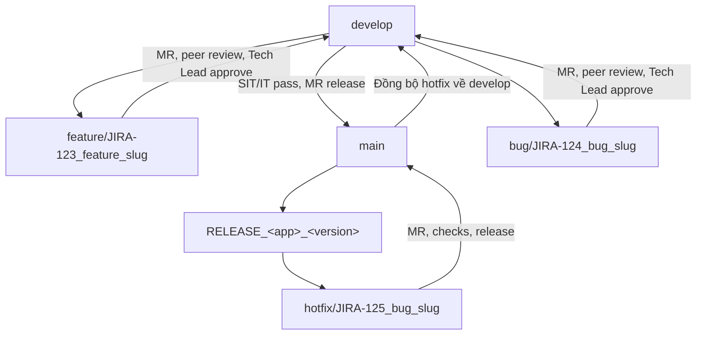

# Quy định Git Flow làm việc nhóm

Đây là quy trình áp dụng cho nhóm dự án VietDoc và có thể dùng làm baseline chung cho các dự án trong công ty. Nếu chính sách công ty hoặc cấu hình bảo vệ branch của một dự án yêu cầu chặt hơn, làm theo yêu cầu đó.

## 1. Branches và quyền ghi

| Branch | Cho phép commit trực tiếp? | Mục đích và điểm xuất phát |
|---|---:|---|
| `main` | Không | Bản release production. Chỉ nhận thay đổi qua MR đã được duyệt. |
| `develop` | Không | Tích hợp tính năng và chạy system/integration test. Chỉ nhận thay đổi qua MR. |
| `feature/<jira_id>_<feature_slug>` | Có | Tính năng mới, tạo từ `develop`; MR đích là `develop`. |
| `bug/<jira_id>_<bug_slug>` | Có | Bug do QA phát hiện trong SIT/IT/System Test, tạo từ `develop`; MR đích là `develop`. |
| `hotfix/<jira_id>_<bug_slug>` | Có | Lỗi production, tạo từ tag release đang chạy; sau xác minh, MR đích là `main`. |

`main` và `develop` phải được bảo vệ trên GitHub: tắt direct push và force push; yêu cầu CI pass và approval trước khi merge. Maintainer/Tech Lead quản lý thiết lập bảo vệ này.

`Commit trực tiếp` ở đây nghĩa là push commit thẳng lên branch dùng chung. Commit trên branch feature/bug/hotfix của mình được phép.

Luồng branch chính:



## 2. Quy tắc đặt tên

Đưa Jira key vào tên branch để lần ngược về task. Phần mô tả dùng chữ thường và `snake_case`. Giữ nguyên cách viết Jira key chuẩn, thường có chữ hoa và dấu gạch nối; không đổi key thành lowercase.

```text
feature/AI-42_extract_receipt_fields
bug/AI-57_fix_invoice_total_rounding
hotfix/AI-61_prevent_empty_invoice_export
```

Mỗi branch giải quyết một task. Tránh tên chung như `feature/update`, `bug/fix` hoặc branch kéo dài qua nhiều task.

Nếu chưa dùng Jira, lấy số GitHub issue làm mã `SE-<số_issue>`, ví dụ `feature/SE-1_receipt_schema`. Chỉ mở issue khi bắt đầu giao việc, không cần tạo toàn bộ backlog trước.

Lần publish đầu tiên của repo dùng `main` cho khung chung, sau đó tạo `develop` từ cùng commit. Đây là bước khởi tạo; các thay đổi phát triển tiếp theo đi qua feature/bug branch và PR theo quy trình dưới đây. Quy định bảo vệ branch trong tài liệu là mục tiêu cấu hình, không có nghĩa setting GitHub đã được bật.

## 3. Feature và QA bug

1. Cập nhật `develop`, tạo branch mới từ branch đó:

   ```bash
   # Chỉ chạy một lần sau khi clone, nếu chưa có develop local
   git fetch origin
   git switch --track -c develop origin/develop

   # Chạy khi bắt đầu mỗi task
   git switch develop
   git pull --ff-only origin develop
   git switch -c feature/AI-42_extract_receipt_fields
   git push -u origin feature/AI-42_extract_receipt_fields
   ```

   Nếu `develop` local đã tồn tại, chỉ cần:

   ```bash
   git fetch origin
   git switch develop
   git pull --ff-only origin develop
   git switch -c feature/AI-42_extract_receipt_fields
   git push -u origin feature/AI-42_extract_receipt_fields
   ```

2. Commit thay đổi theo task; chạy focused checks trước khi mở Merge Request (MR). Trên GitHub, MR được gọi là Pull Request (PR).
3. Mở MR từ branch task vào `develop`. Mô tả MR nêu Jira key, mục tiêu, acceptance, cách kiểm tra, ảnh hưởng schema/migration/model và rủi ro liên quan.
4. Thêm ít nhất một developer khác làm reviewer; tác giả không tự approve. Reviewer ghi comment vào vấn đề cần sửa. Tác giả xử lý hoặc phản hồi từng comment trước khi xin duyệt cuối.
5. Sau khi review chéo hoàn tất, Lead của dự án kiểm tra thiết kế, hợp đồng, phạm vi và kết quả CI. Chỉ merge khi Lead approve và các required checks đều pass.
6. Bật xóa tự động branch task sau khi merge. Không xóa `main` hoặc `develop`.

Bug do QA log trong giai đoạn test dùng cùng quy trình, nhưng tên branch có tiền tố `bug/` và luôn tách từ `develop`.

### Khi review yêu cầu sửa

- Tác giả commit phần sửa trên branch task và cập nhật MR.
- Reviewer kiểm tra lại các dòng/luồng bị ảnh hưởng; chạy lại checks liên quan.
- Không merge chỉ vì đã có một approval cũ nếu commit mới làm thay đổi nội dung reviewer đã duyệt.

## 4. Build, test và release

Build/CI có thể chạy cho từng MR. Tạo tag cho một build đã chọn làm mốc kiểm thử hoặc release, không gắn tag lặp lại cho mỗi lần CI chạy.

| Loại | Commit/tag lấy từ | Dùng khi |
|---|---|---|
| Build kiểm thử `BUILD` | Commit cụ thể trên `develop` sau khi các MR tính năng đã merge | Đưa integration candidate vào SIT/IT/System Test. |
| Release `RELEASE` | Commit cụ thể trên `main` đã qua gate release | Phát hành production. |

Tag format:

```text
BUILD_<app>_<version>
RELEASE_<app>_<version>
```

Ví dụ:

```text
BUILD_VietDoc_1.2.0-rc.1
RELEASE_VietDoc_1.2.0
```

Dùng version tăng dần, không trùng. Tag phải trỏ tới đúng commit đã build/test. Bảo vệ tag để không di chuyển, xóa hoặc tái sử dụng; nếu build lỗi thì tạo version mới sau khi sửa. Lưu link tag, MR, CI run và release artifact trong thông tin build/release. Rollback dùng lại artifact đã phát hành trước đó, không di chuyển tag.

Luồng release:

1. Sau khi tính năng đã merge vào `develop`, chọn một commit candidate và tạo build kiểm thử `BUILD_...`.
2. Chạy SIT/IT/System Test trên đúng candidate. Ghi kết quả và bug còn mở.
3. Khi test đạt, mở MR từ `develop` vào `main`. Tech Lead review và approve; CI phải pass.
4. Sau khi merge, build từ commit trên `main` và chạy release smoke/gates trên đúng artifact đó. Khi pass, tạo `RELEASE_...` tag trỏ tới commit này và phát hành chính artifact đã kiểm tra.

Build test trước release giúp truy nguyên commit đã kiểm thử; release tag giúp tìm lại chính xác mã nguồn và artifact production để diff hoặc phục hồi.

## 5. Hotfix production

Hotfix bắt đầu từ tag release đang chạy để chỉ mang theo bản sửa cần cho production. Không bắt đầu từ `develop`, vì `develop` có thể chứa các tính năng chưa release.

```bash
git fetch origin --tags
git switch -c hotfix/AI-61_prevent_empty_invoice_export RELEASE_VietDoc_1.2.0
```

1. Sửa đúng lỗi production; bổ sung regression test nếu phù hợp; chạy focused tests và build candidate từ hotfix branch.
2. Mở MR từ `hotfix/...` vào `main`. Ghi tag nguồn, triệu chứng, tác động, cách test và kế hoạch phát hành.
3. Tech Lead review/approve và CI pass. Kiểm tra hotfix candidate trên môi trường phát hành theo quy trình production của công ty.
4. Merge vào `main`, build và kiểm tra artifact cuối. Khi pass, tạo tag `RELEASE_...` mới trỏ commit hotfix trên `main` và phát hành đúng artifact đó. Không ghi đè tag cũ.
5. Mở MR đồng bộ `main` vào `develop` để đưa hotfix production trở lại nhánh phát triển. Resolve conflict và chạy checks liên quan trước khi merge.

Không merge toàn bộ `develop` vào hotfix branch trước khi production release. Nếu cần kiểm tra tương thích với các thay đổi đang phát triển, làm trên một nhánh tích hợp/candidate riêng; MR vào `main` chỉ được chứa thay đổi cần phát hành.

## 6. Cập nhật branch và xử lý conflict

Trước khi mở MR, cập nhật branch task với `develop` mới nhất. Có thể rebase branch cá nhân trước lần push đầu. Sau khi branch đã được push/chia sẻ, ưu tiên merge `origin/develop` vào branch task để tránh viết lại lịch sử; không dùng force push.

Khi có conflict:

- Đọc cả hai thay đổi và xác định hành vi mong muốn; không chọn `ours`/`theirs` cho toàn file theo thói quen.
- Nếu conflict ở schema, OpenAPI hoặc migration, nhờ owner tương ứng và Tech Lead thống nhất hướng xử lý trước khi sửa.
- Sau khi resolve, chạy test/lint/build bị ảnh hưởng, push cập nhật branch và yêu cầu reviewer kiểm tra lại.
- Nếu conflict làm thay đổi acceptance hoặc contract đã duyệt, cập nhật MR/Jira trước khi merge.

## 7. Danh sách kiểm tra trước khi merge

- MR đúng source branch và target branch.
- Jira key, acceptance và phạm vi thay đổi rõ ràng.
- CI và focused tests pass; kết quả test có trong MR.
- Reviewer chéo đã xử lý comment; Tech Lead đã approve.
- Không có secret, file `.env`, dữ liệu thật, raw dataset hoặc model weights trong diff.
- Schema/API, migration, dataset split hoặc model manifest có cập nhật tương ứng nếu thay đổi đó yêu cầu.
- Branch task được xóa tự động sau khi merge; `main`/`develop` được giữ lại.

## 8. Vai trò của code review

Review chéo giúp phát hiện lỗi logic, regression và vấn đề maintainability sớm; chia sẻ kiến thức để thành viên khác có thể tiếp quản; và tạo dấu vết rõ ràng về quyết định trước khi code vào branch tích hợp. Reviewer phản hồi vào thay đổi cụ thể, tác giả trả lời và cập nhật code; Tech Lead chịu trách nhiệm duyệt cuối theo quyền được phân công.
